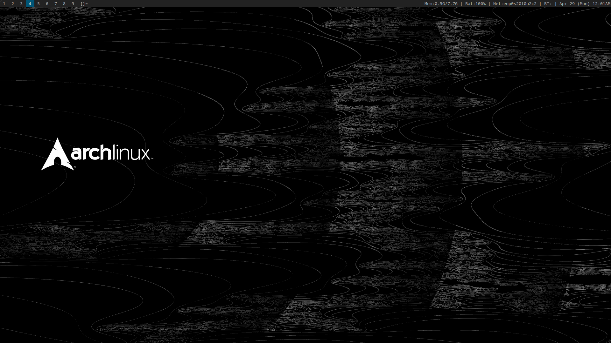

"This is where I keep all my dotfiles. Note: Each folder doesn't contain all the files required for that specific software to run; it only contains the customizable files. The folders are present for easy navigation and organization purposes. I don't recommend that you use my setup as it is, but rather take parts of it to help achieve your dream Linux system, which is completely unique."

## Software I Use

This is a detailed list of all the software I use on my system for daily tasks and stuff, this list won't include every software I have used or am using, it only includes the ones that I use more often or I think should be included to complete the list. It can change at any time, as it probably will because in Linux the fun part is there are so many options.

### Essential System Components:

- **Kernel:** [Linux](https://github.com/torvalds/linux)
- **Distro:** [Arch Linux](https://archlinux.org/)
- **Display Manager:** [ly](https://github.com/fairyglade/ly)
- **System and Service Manager:** [Systemd](https://systemd.io/)
- **X Server:** [Xorg](https://www.x.org/wiki/)
- **Window Manager:** [dwm](https://dwm.suckless.org/) with the following patches:
  - **Layout Patches(I love to use the default ones,these layouts are for specific situations only):**
    - [Bottomstack (Bstack,Bstackhoriz)](https://dwm.suckless.org/patches/bottomstack/)
    - [Centeredmaster (Centeredmaster,Centeredfloatingmaster)](https://dwm.suckless.org/patches/centeredmaster/)
    - [Deck](https://dwm.suckless.org/patches/deck/)
    - [Fibonacci (Dwindle, Spiral)](https://dwm.suckless.org/patches/fibonacci/)
    - [Grid](https://dwm.suckless.org/patches/gridmode/)
    - [Nrowgrid](https://dwm.suckless.org/patches/nrowgrid/) 
  - **Visual Enhancements:**
    - [Vanitygaps](https://dwm.suckless.org/patches/vanitygaps/)
- **Compositor:** [picom](https://github.com/yshui/picom)
- **Status Bar:** [dwmblocks](https://github.com/torrinfail/dwmblocks)
- **Lockscreen:** [slock](https://tools.suckless.org/slock/)
- **Terminal:** [kitty](https://github.com/kovidgoyal/kitty)
- **Launcher:** [rofi](https://github.com/davatorium/rofi)
  - **Theme:** [rounded-red-dark.rasi](https://github.com/newmanls/rofi-themes-collection)
- **Sound Server:** [PulseAudio](https://www.freedesktop.org/wiki/Software/PulseAudio/)
- **System Information Tool:** [Fastfetch](https://github.com/fastfetch-cli/fastfetch)

### Basic Utilities:

- **Browser:** [Vivaldi](https://vivaldi.com) with the following extensions:
  - **Ad Blocker:** [AdGuard](https://adguard.com/)
  - **Enable Right Click Copy:** [Absolute Enable Right Click & Copy](https://chromewebstore.google.com/detail/absolute-enable-right-cli/jdocbkpgdakpekjlhemmfcncgdjeiika)
  - **Clear Cache:** [Clear Cache](https://chrome.google.com/webstore/detail/clear-cache/cppjkneekbjaeellbfkmgnhonkkjfpdn)
  - **Grammar Checker:** [Grammarly](https://chromewebstore.google.com/detail/grammarly-ai-writing-and/kbfnbcaeplbcioakkpcpgfkobkghlhen?pli=1)
  - **YouTube Enhancer:** [Enhancer for YouTube](https://chrome.google.com/webstore/detail/enhancer-for-youtube/ponfpcnoihfmfllpaingbgckeeldkhle)
  - **Volume Control:** [Volume Master](https://chrome.google.com/webstore/detail/volume-master/jghecgabfgfdldnmbfkhmffcabddioke)
- **Multimedia Player:** [VLC](https://www.videolan.org/vlc/)
- **File Manager:** [lf](https://github.com/gokcehan/lf)
- **Fonts:** [Noto Sans](https://github.com/notofonts/noto-docs)
- **Text Editor:** [Neovim](https://neovim.io/) with [NvChad](https://nvchad.com/)
  - **Theme:** [darkhorizon](https://nvchad.com/)
- **Volume Control:** [Pavucontrol](https://freedesktop.org/software/pulseaudio/pavucontrol/) for comprehensive audio management, [pamixer](https://github.com/cdemoulins/pamixer) and [pactl](https://www.freedesktop.org/wiki/Software/PulseAudio/Documentation/Developer/Clients/Pactl/) for quick and scriptable volume adjustments.
- **Notifications:** [Dunst](https://github.com/dunst-project/dunst)

### Productivity and Creativity Tools:

- **MS-365-Electron:** [MS-365-Electron](https://github.com/agam778/MS-365-Electron)
- **Video Editor:** [Shotcut](https://shotcut.org/)
- **Digital Drawing:** [Krita](https://krita.org/en/)
- **Image Manipulation:** [GIMP](https://www.gimp.org/) and [Canva](https://www.canva.com/)
- **Image Illustrator:** [Inkscape](https://inkscape.org/)
- **DAW:** [Ardour](https://ardour.org/)
- **Game Engine:** [Godot](https://godotengine.org/)
- **3D Modeling:** [Blender](https://www.blender.org/)
- **Virtual Machine:** [Virtual Machine Manager](https://virt-manager.org/)
- **Download Manager:** [uGet](https://ugetdm.com/)
- **Torrent Manager:** [qbittorrent](https://www.qbittorrent.org/)
- **Network Manager:** [NetworkManager](https://networkmanager.dev/) and [rofi-network-manager](https://github.com/P3rf/rofi-network-manager)
- **Hotspot Manager:** [linux-wifi-hotspot](https://github.com/lakinduakash/linux-wifi-hotspot)
- **Bluetooth Manager:** [Blueman](https://github.com/blueman-project/blueman)

### Advanced Tools:

- **Network Protocol Analyzer:** [Wireshark](https://www.wireshark.org/)
- **Message Broker:** [Apache Kafka](https://kafka.apache.org/)
- **Containerization Platform:** [Docker](https://www.docker.com/)
- **Container Orchestration:** [Kubernetes](https://kubernetes.io/) with [MiniKube](https://minikube.sigs.k8s.io/docs/)
- **Monitoring:** [Prometheus](https://prometheus.io/)
- **Visualization:** [Grafana](https://grafana.com/)
- **Embedded Systems Development:** [PlatformIO](https://platformio.org/)
- **API Development Tool:** [Postman](https://www.postman.com/)
- **Task Management:** [Trello](https://trello.com/)
